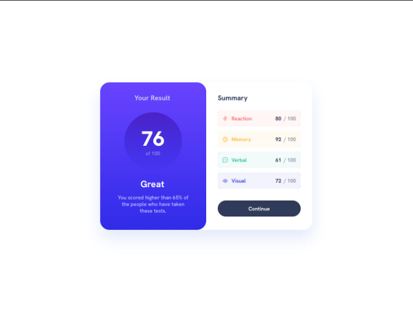

# Frontend Mentor - 🚀 Results summary component 🚀

## Summary 

The results summary component is a challenge proposed by Frontend Mentor in order to improve html and css skills of new frontend developers.

This challenge aims to develop an simple results summary component with two main screens resolutions: 1440px x 1050px (desktop monitors) and 375px x 750px (smarthphones devices).

## Skills requeriments! 👋

**To do this challenge, you need a basic understanding of:**

**1 - HTML - HTML structure and semantic HTML**

**2 - CSS - stilization, flexbox, class selectors, active states, media queries and nesting CSS**

**3 - Javascript - JSON requisiotion and real-time printing data**

## The challenge

The challenge consists to build out the results summary component and get it looking as close to the design as possible.

## Limitations

Althought you can use any tools to help you complete the challenge, the 50% magnification of preview and design pieces difficults the real measure of distance between some design elements.

In order to overcome this limitiation, the developer use Figma resources to measure this distances.

Another challenging step was to determinate the exact color gradient of results section related to the absence of Figma prototye on challenge project files.

## Solving the Challenge

The first step of solving the challenge was read the style-guide.md file in order to understand the main stilization pattern applied to HTML document.

After reading the style-guide and README-template.md files, the developer starts to document main stilization variables on style.css file. This reflects a good programing practice to ease future modifications and reduce maintanance time loss.

The mobile-first web development was chose to assure the compatibility of the result summary component in small devices (320px, 375px and 425px), while the challenge requests only the screen size of 375px. 

The style.css file contains font, spacing, margin and other stilization parameters applied to all results summary component html development.

The next step was the development of a semantic HTML structure to obtain a result summary component.

Then, the developers choose to separate main sections CSS files to ease the documentation and maintainance of codes.

In addition, after mobile-first HTML development the web document was adapted by medium (tablet 768px x 768px) and large screens (1440px x 1050px), even if the challenge provided only 1440px x 1050px screen size design.

## Design models

The provided design model by Frontend Mentor for small (375px) and large (1440px) devices are demonstrated below:

## 🚀 My solution 🚀

The first-step of developing result summary component was determinate how containers structure could be made to facilitate the correct alignment of elements on html document.

The developer choose to structure the elements on project using flexbox properties because of its efficience on adjust of position of texts, images and layers.

The HTML strucuture contains semantic HTML tags to assure good programming practices, but considering that one part of data will be provided by a dynamic JSON. In addition, css files were created to catalog main stelization specifications of project (style.css) and other two css files to each section of index.html file (section-results.css and section-summary.css). This strategy was selected because of the better understanding of variables and the ease of refactor and maintanance of codes.

The style.css was made with root specifications provided by the challenge on README-template.md and styel-guide.md. The main CSS file also contains style applications of the main sections and containers of index.html file.

The second-step was to create a javascript file (main.js) to attribute dynamic data from a JSON for the summary section categories, icons and values. After the compreehension of programming logic applied to the development, the JSON return was made successfully and specific stilization styles were applied on each individual element by nth-child() properties.
